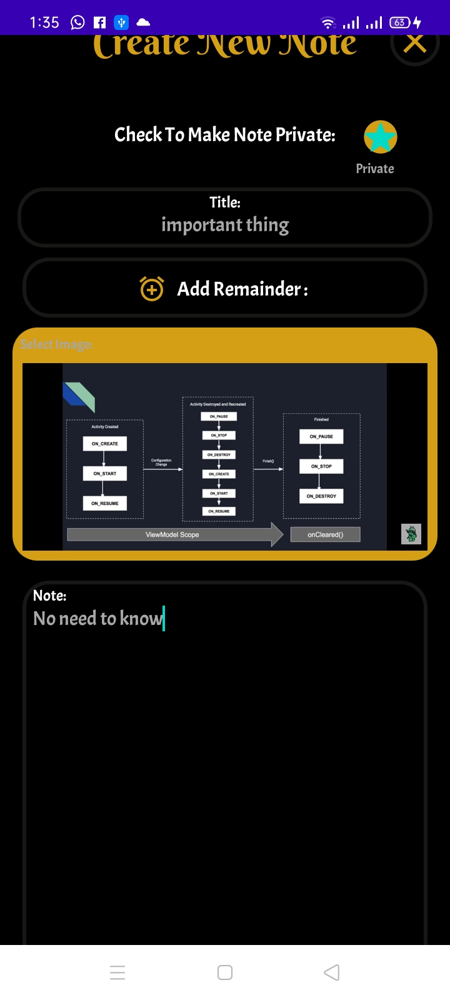
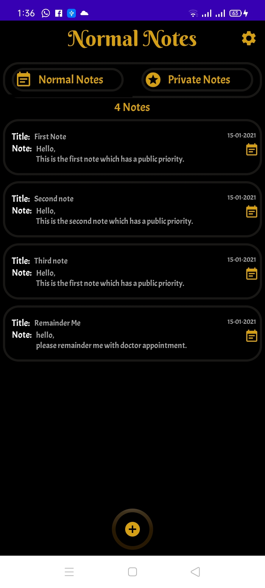
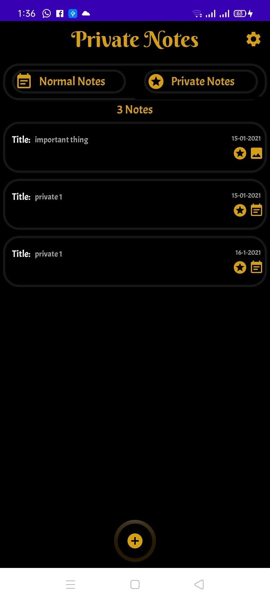
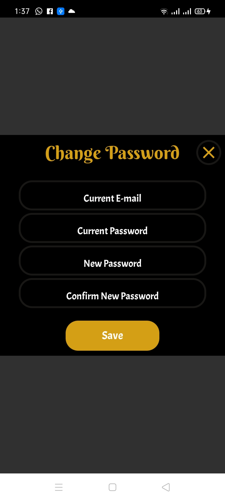
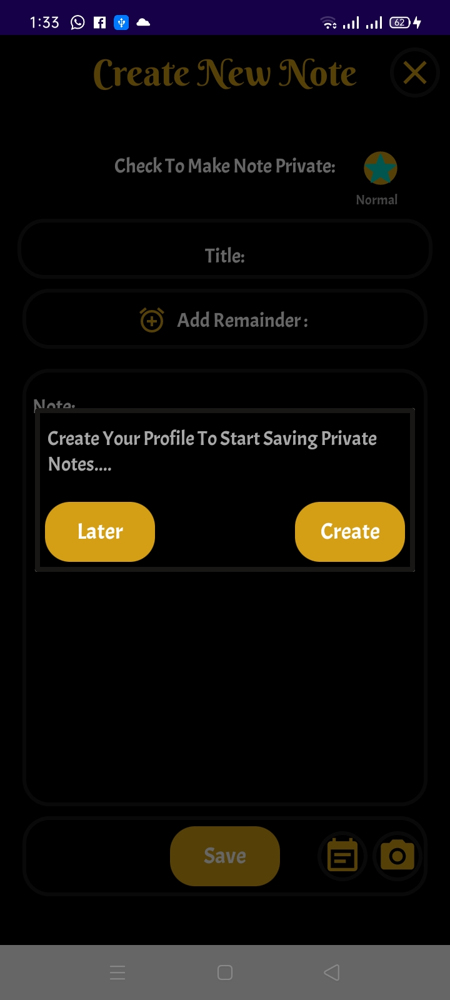
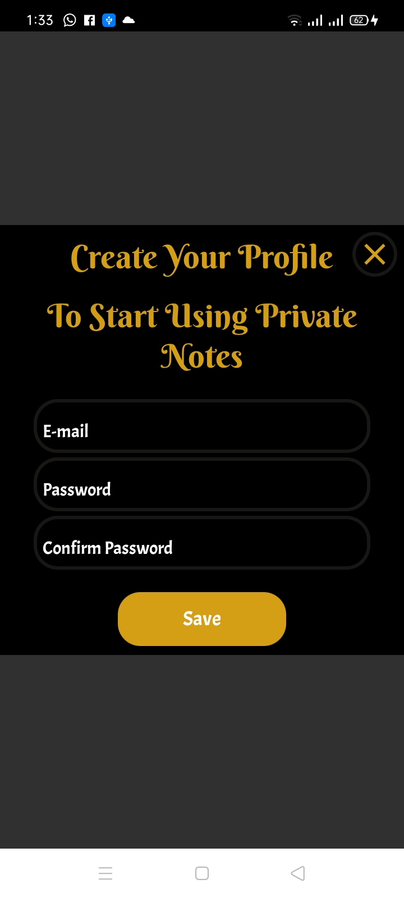
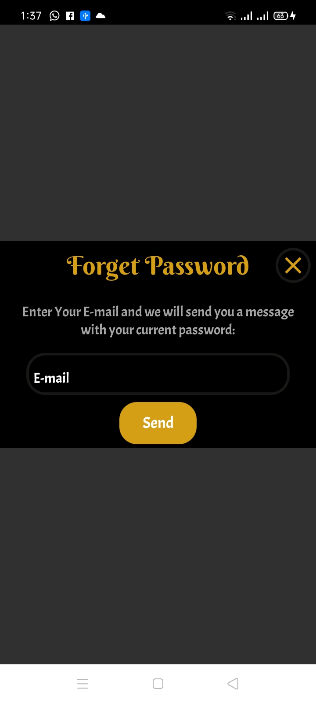
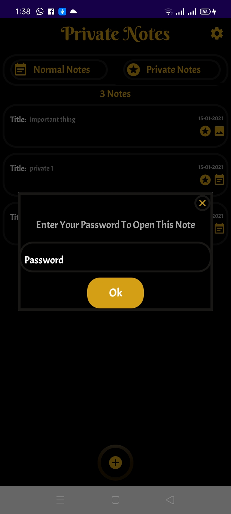

# Smart-Note
# MVVM - ROOM - RxJava - Data Binding - Broad Cast Receiver - Notification Manager
# Description: 
    • Save Notes which can be (Text Or Image) With The Ability To Add Remainder To It.
    • Note Priority Can be Normal Or Private Note Whcih Require Password To Access It.
    • Password Can be easily Retrived By Mail.
    • You also can add Reminder  to specific note.
# Technologies in development :
    1. SQL Lite Room Database.
    2. MVVM With Data Binding And Live Data.
    3. Broad Cast Receiver To Set Remainder.
    4. Notification Manger As Back ground Service.

# Screen-Shots:

